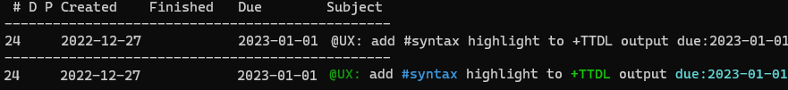

# TTDL (Terminal ToDo List)


[](https://crates.io/crates/ttdl)
[](https://crates.io/crates/ttdl)

A CLI tool to manage todo lists in [todo.txt format](http://todotxt.org/). A short demo of TTDL in action:


For better readability, you can enable syntax highlighting (via command-line option `--syntax` or by enabling it in the configuration file).
Colors for tags, projects, contexts, and hashtags are customizable: see details in the configuration file, section `[syntax]`.
Example of the same todo output with default options and with syntax highlighting on:



## Installation

The application can be compiled from source, or installed using cargo:

```shell
$ cargo install ttdl
```

You need Rust compiler that supports Rust 2018 edition (Rust 1.31 or newer) to do it. If you want to upgrade existing ttdl execute the following command:

```shell
$ cargo install ttdl --force
```

### Precompiled binaries

For Windows and Ubuntu you can download precompiled binaries from [Release page](https://github.com/VladimirMarkelov/ttdl/releases).

* Windows binary works on Windows 7 or newer Windows.
* Ubuntu binary tested on Ubuntu 16 but should work on Ubuntu 18 (and maybe on other deb-based Linux distributions)

## Known issues

**Adding a new todo, append or prepend a text to existing todo results in error:**

It may happen if the text starts with(or contains only) a project or a context:

```shell
$ ttdl add "+myproject"
Subject is empty
```

**Workaround**: add a space between quotation mark and '+' or '@' symbol. The todo will be added without leading space:

```shell
$ ttdl add " +myproject"
Added todo:
# D P Created    Finished   Due        Threshold  Subject
----------------------------------------------------------
8                                                 +myproject
```

## Configuration

TTDL is a standalone binary and it does not create any files in user's directory. But at start, it checks for a configuration file - please see example configuration (ttdl.toml)[./ttdl.toml] in user's configuration directory and loads it. Local configuration files are supported as well. Locations where TTDL looks for a configuration file:

* current working directory
* Linux:  `~/.config/ttdl/ttdl.toml`
* Windows: `c:\Users\{username}\AppData\Roaming\ttdl\ttdl.toml`
* OSX: `/Users/{username}/Library/Application Support/ttdl/ttdl.toml`

To check in which directory TTDL looks for its configuration file, please refer to the table [Features](https://github.com/dirs-dev/dirs-rs#features), function name `config_dir`.

## How to use

Run TTDL with the command line:

```
ttdl [command] [ID range] [subject] [filter options] [extra options]
```

### Supported commands

The list of available command is short but the commands are powerful. All commands support group operations and dry run mode. Except `add` command that adds a new todo one at a time. Please, refer to section "Examples", it provides a handful of useful examples of how to filter and modify todo list.

Commands:

* add - add a new todo;
* list - show list of todo items. By default it displays all incomplete todos;
* done - mark selected todos completed. If a todo is recurrent its due date moves to the next date but the todo remains incomplete;
* undone - remove `finished` mark from completed todos;
* remove - deletes the selected todos;
* clean  - moves completed todos from main file to `done.txt`. The file `done.txt` is created(if it does not exist) in the same directory where main todo list file is located;
* edit - modify one or few properties for the selected todos. One exception: modifying todo's subject changes only the first selected todo, others are skipped;
* append - adds a text to the end of the selected todos (space between old text and new one is added automatically);
* prepend - inserts a new text at the beginning of the selected todos (space between old text and new one is added automatically);
* start - activate todo's timer;
* stop - stop todo's timer and update time spent on the todo;
* stats - display todo statistics: total number of todos, done and overdue ones, spent time, and detailed statistics grouped by project and context.
* postpone - push task's due date (modifies only incomplete tasks with due date defined), argument is the number of days/weeks/months/years to push the date in format: single digit and d/w/m/y without a space between them

Most of the commands can be abbreviated. Please refer to built-in TTDL help to get a list of full command names and their aliases.

NOTE: `done` moves a recurrent todo's due date to the next one, but it does not check if the new due date is in the future (it is by design). So, if a monthly task is 2 months overdue, you have to execute `ttdl done ID` two times to push it to the incoming month or manually set a new due date with the command `ttdl edit ID --set-due=YYYY-MM-DD`.


For detailed description please see [README.md](README.md)
